# 📅 Productivity App Project Frontend

The Productivity App is a calendar-driven web application designed to help users organize their time efficiently. This browser-based platform enables users to create, manage, and track tasks through a clean, intuitive, and responsive interface, ensuring seamless productivity across devices.

[View the website here](#)

---

## Table of Contents

- [📅 Productivity App Project Frontend](#-productivity-app-project-frontend)
  - [Table of Contents](#table-of-contents)
  - [Project Goals](#project-goals)
  - [User Stories for Productivity App](#user-stories-for-productivity-app)
    - [User Story 1: Account Creation \& Login](#user-story-1-account-creation--login)
    - [User Story 3: Create Task](#user-story-3-create-task)
    - [User Story 4: Set Due Date](#user-story-4-set-due-date)
    - [User Story 5: Mark Task as Overdue](#user-story-5-mark-task-as-overdue)
      - [Acceptance Criteria:](#acceptance-criteria)
    - [User Story 6: Assign/Unassign Task Owners](#user-story-6-assignunassign-task-owners)
    - [User Story 7: Set Task Priority](#user-story-7-set-task-priority)
    - [User Story 8: Categorize Tasks](#user-story-8-categorize-tasks)
    - [User Story 9: Set Task State](#user-story-9-set-task-state)
    - [User Story 10: Task Filtering](#user-story-10-task-filtering)
    - [User Story 11: Responsive Design](#user-story-11-responsive-design)
  - [User Story 12: Search Functionality](#user-story-12-search-functionality)
    - [Acceptance Criteria](#acceptance-criteria-1)
- [Break Down of User Stories into Tasks](#break-down-of-user-stories-into-tasks)
  - [User Story 1: Account Creation \& Login](#user-story-1-account-creation--login-1)
  - [User Story 2: Profile Management](#user-story-2-profile-management)
  - [User Story 3: Create Task](#user-story-3-create-task-1)
  - [User Story 4: Set Due Date](#user-story-4-set-due-date-1)
  - [User Story 5: Mark Task as Overdue](#user-story-5-mark-task-as-overdue-1)
  - [User Story 6: Assign/Unassign Task Owners](#user-story-6-assignunassign-task-owners-1)
  - [User Story 7: Set Task Priority](#user-story-7-set-task-priority-1)
  - [User Story 8: Categorize Tasks](#user-story-8-categorize-tasks-1)
  - [User Story 9: Set Task State](#user-story-9-set-task-state-1)
  - [User Story 10: Task Filtering](#user-story-10-task-filtering-1)
  - [User Story 11: Responsive Design](#user-story-11-responsive-design-1)
  - [User Story 12: Search Functionality](#user-story-12-search-functionality-1)
  - [Technologies Used](#technologies-used)
    - [Front-End](#front-end)
    - [Back-End](#back-end)
    - [Tools \& Project Management](#tools--project-management)
  - [Design](#design)
    - [Color Scheme](#color-scheme)
    - [Typography](#typography)
    - [Wireframes](#wireframes)
    - [Component-Based Architecture](#component-based-architecture)
    - [Accessibility](#accessibility)
  - [Agile Methodology](#agile-methodology)
  - [Version Control](#version-control)
  - [Features](#features)
    - [Existing Features](#existing-features)
- [Component-Based Architecture](#component-based-architecture-1)
- [Accessibility](#accessibility-1)
- [Agile Methodology](#agile-methodology-1)
- [Version Control](#version-control-1)
  - [Examples](#examples)
- [Features](#features-1)
  - [Existing Features](#existing-features-1)
    - [General Features](#general-features)
    - [Navigation Bar](#navigation-bar)
    - [Home Page Component](#home-page-component)
    - [User Register Component](#user-register-component)
    - [User Login Component](#user-login-component)
    - [Create Task Component](#create-task-component)
    - [Task List Component](#task-list-component)
    - [Not Found Component](#not-found-component)
    - [Protected Route Component](#protected-route-component)
- [Testing](#testing)
  - [Manual Testing](#manual-testing)
  - [Automated Testing](#automated-testing)
- [Known Issues](#known-issues)
- [Deployment](#deployment)
  - [Render](#render)
- [Final Frontend Project Scope Reflection](#final-frontend-project-scope-reflection)
  - [Project Background](#project-background)
  - [What Changed](#what-changed)
  - [Final Features Implemented](#final-features-implemented)
  - [Features Postponed](#features-postponed)
  - [Reflection](#reflection)
  - [What’s Next?](#whats-next)
- [Credits](#credits)
  - [Tutorials \& Code Used](#tutorials--code-used)
  - [Acknowledgments](#acknowledgments)

---

## Project Goals

The Productivity App frontend aims to deliver a user-centric, responsive platform for task management with the following specific objectives (addressing **LO2.2**):

- **Seamless Authentication**: Implement secure user registration and login using JWT, with clear feedback via react-toastify for success/errors and username display in the NavBar to indicate login status (LO4.2, LO4.7).
- **Efficient Task Management**: Enable users to create and view tasks with details like title, description, due date, priority, category, status, and assigned users, with real-time CRUD notifications (LO4.2).
- **Responsive Design**: Deliver a fully responsive UI using React and Bootstrap, ensuring accessibility across desktops, tablets, and mobiles (LO1.9).
- **Advanced Filtering**: Allow task filtering by category and status, with a search bar for title/description queries, enhancing task navigation (LO4.2).
- **Code Quality**: Maintain clean, modular code with ESLint for JavaScript and descriptive commit messages, adhering to best practices (LO1.13, LO3.1, LO3.11).
- **Agile Development**: Use GitHub Issues, Project Boards, MoSCoW prioritization, and milestones to manage development transparently (LO2.3).
- **User Feedback**: Provide immediate visual feedback for all user actions (e.g., task creation, login) using alerts and toasts, improving UX (LO4.2).

---

## User Stories for Productivity App

### User Story 1: Account Creation & Login

**As a new user**  
I want to create an account and log in,  
so that I can access the app and manage my tasks.

**Acceptance Criteria**:

- Register with a unique email, name, and password.
- Log in with existing credentials.
- Receive feedback for failed registration/login.

---

### User Story 3: Create Task

**As a user**  
I want to create a task,  
so that I can keep track of my tasks.

**Acceptance Criteria**:

- Input task details (title, description, due date, priority, category, status, assigned users).
- Receive confirmation via toast notification upon successful creation.
- Display new task in the task list.

---

### User Story 4: Set Due Date

**As a user**  
I want to set a due date for my tasks,  
so that I can manage deadlines effectively.

**Acceptance Criteria**:

- Select due date via date picker.
- Display due date in task list.
- Prevent selection of past dates.

---

### User Story 5: Mark Task as Overdue

**As a** user,  
**I want to** mark tasks as overdue,  
**so that** I can prioritize tasks that are past their due date.

#### Acceptance Criteria:

- The application automatically marks the task as overdue if the current date exceeds the due date.
- Overdue tasks are visually distinct in the task list (e.g., using color coding).
- Users can manually adjust overdue statuses if necessary.

---

### User Story 6: Assign/Unassign Task Owners

**As a user**  
I want to assign or unassign multiple owners to a task,  
so that I can collaborate effectively.

**Acceptance Criteria**:

- Select multiple users from a list to assign to a task.
- Display assigned users in task details.

---

### User Story 7: Set Task Priority

**As a user**  
I want to set a priority for each task,  
so that I can focus on what’s important.

**Acceptance Criteria**:

- Choose priority (low, medium, high).
- Display priority in task list.
- Filter tasks by priority.

---

### User Story 8: Categorize Tasks

**As a user**  
I want to categorize my tasks,  
so that I can organize them by project or theme.

**Acceptance Criteria**:

- Assign categories during task creation.
- Display categories in task list.
- Filter tasks by category.

---

### User Story 9: Set Task State

**As a user**  
I want to set the state of my task (pending, in progress, done),  
so that I can track progress.

**Acceptance Criteria**:

- Change task state via dropdown.
- Display current state in task list.

---

### User Story 10: Task Filtering

**As a user**  
I want to filter my tasks by category, status, and search by title/description,  
so that I can find relevant tasks quickly.

**Acceptance Criteria**:

- Provide filter options for category and status.
- Include a search bar for title/description queries.
- Update task list dynamically.

---

### User Story 11: Responsive Design

**As a user**  
I want to access the app on multiple devices,  
so that I can manage tasks anywhere.

**Acceptance Criteria**:

- Ensure responsive, functional UI across devices.
- Maintain consistent navigation and usability.

---

## User Story 12: Search Functionality

**As a user,** I want to be able to search for tasks by keywords in their title or description,  
**so that** I can quickly find the specific tasks I am looking for.

### Acceptance Criteria

- A search bar is displayed at the top of the task list page.
- When I type a keyword into the search bar and press enter (or type continuously), the task list updates to show only tasks whose title or description matches the keyword.
- The search works regardless of letter case (case-insensitive).
- If no tasks match the keyword, a message such as **“No tasks found”** is displayed.
- Clearing the search bar restores the full list of tasks.
- The search query is processed in real time (React captures input, sends request to backend, and updates the task list dynamically).

---

> **Note:**  
> User Story 2 (**Profile Management**), User Story 5 (**Mark Task as Overdue**), and User Story 12 (**Search Functionality**) were planned but not implemented due to scope reduction, as detailed in the **Final Frontend Project Scope Reflection**.

---

# Break Down of User Stories into Tasks

## User Story 1: Account Creation & Login

**Tasks:**

- Design registration form with name, email, password, and confirm password fields.
- Implement backend registration endpoint (`/api/register/`).
- Handle form submission in `Register.js` with POST request via `api.js`.
- Display toast notifications for success/errors (e.g., duplicate email).
- Design login form with email and password fields.
- Implement backend login endpoint (`/api/login/`).
- Handle login in `Login.js` with POST request, store JWT, and redirect to `/tasklist`.
- Ensure protected routes redirect unauthenticated users to `/login`.

---

## User Story 2: Profile Management

**Tasks:**

- Design Profile Page: Create a UI layout for user profile information editing.
- Implement Backend Endpoint for Profile: Create endpoints for retrieving and updating user profile data.
- Handle Profile Data Fetching: Use React to fetch and display the user data.
- Implement Edit Functionality: Add logic to capture changes and send PATCH requests to update user data.
- Display Success/Error Messages: Show messages based on the success or failure of profile updates.

---

## User Story 3: Create Task

**Tasks:**

- Design task creation form in `CreateTask.js` with fields for title, description, due date, priority, category, status, and assigned users.
- Implement backend task creation endpoint (`/api/tasks/`).
- Handle form submission with POST request and display toast notification.
- Refresh task list after successful creation.

---

## User Story 4: Set Due Date

**Tasks:**

- Integrate `react-datepicker` in `CreateTask.js`.
- Include due date in POST/PATCH requests.
- Display due date in `TaskList.js`.
- Validate date picker to prevent past dates.

---

## User Story 5: Mark Task as Overdue

**Tasks:**

- Define Overdue Logic: Implement logic in the backend to check if a task is overdue based on the current date and due date.
- Update Task Model: Add an `is_overdue` field to the task model, if necessary.
- Display Visual Indicators: Update UI to visually distinguish overdue tasks (e.g., through color coding).
- Implement Filter for Overdue Tasks: Add functionality to filter the task list by overdue status.

---

## User Story 6: Assign/Unassign Task Owners

**Tasks:**

- Add multi-select dropdown for users in `CreateTask.js`.
- Implement backend logic for `assigned_users` in `/api/tasks/`.
- Display assigned users in `TaskList.js` task details.

---

## User Story 7: Set Task Priority

**Tasks:**

- Add priority dropdown in `CreateTask.js`.
- Update backend to handle priority field.
- Display priority in `TaskList.js`.
- Implement priority filter in `TaskList.js`.

---

## User Story 8: Categorize Tasks

**Tasks:**

- Add category dropdown in `CreateTask.js`.
- Update backend to handle category field.
- Display category in `TaskList.js`.
- Implement category filter in `TaskList.js`.

---

## User Story 9: Set Task State

**Tasks:**

- Add status dropdown in `CreateTask.js`.
- Update backend to handle status field.
- Display status in `TaskList.js`.

---

## User Story 10: Task Filtering

**Tasks:**

- Design filter panel in `TaskList.js` with category, status, and search inputs.
- Implement backend filtering for `/api/tasks/` (category, status, search).
- Handle filter/search inputs in `TaskList.js` and update task list dynamically.

---

## User Story 11: Responsive Design

**Tasks:**

- Integrate Bootstrap for responsive layouts in all components.
- Test UI across desktop, tablet, and mobile screen sizes.
- Adjust layouts for optimal usability on smaller screens.

---

## User Story 12: Search Functionality

**Tasks:**

- Add Search Bar UI: Create a search input field at the top of the task list.
- Implement Search Logic in Backend: Create a search endpoint that filters tasks based on keywords in titles/descriptions.
- Capture Search Input in React: Handle the input from the search bar and send the search request to the backend.
- Display Search Results: Dynamically update the task list to reflect search results.

---

## Technologies Used

### Front-End

- **HTML5** – Semantic markup for structuring content.
- **CSS3** – Responsive styling with modern layout techniques.
- **JavaScript (ES6+)** – Dynamic behavior and logic handling.
- **React.js** – Component-based UI development.
- **JSX** – Syntax extension for writing HTML in JavaScript.
- **Bootstrap** – Styling and responsive UI components.
- **Axios** – HTTP client for API requests.
- **React Router** – Client-side routing for SPA behavior.
- \*\*React Toastify: Real-time notifications for CRUD operations (LO4.2).
- **ESLint** – Code linting to enforce code quality(L03.1).
- **Git & GitHub** – Version control and collaborative development.
- **Heroku** – Front-End deployment to the cloud.

### Back-End

- **Python 3** – General-purpose programming for logic and data handling.
- **Django** – High-level web framework for building the application structure.
- **Django REST Framework (DRF)** – API creation with full CRUD capabilities.
- **PostgreSQL / SQLite** – Relational database for storing user and content data.
- **djoser / Simple JWT** – Token-based authentication.
- **Git & GitHub** – Back-End version control and project tracking.
- **Render.com** – Deployment of the API to a API deployment cloud platform.
- **Environment Variables** – Securing sensitive credentials and configuration.

### Tools & Project Management

- **VS Code** – Source code editor with extensions for React and Django.
- **Github** - Used for project management and version control.
- **Balsamiq** - Wireframe creation for UI planning.
- **Chrome DevTools** - Debugging and responsiveness testing.

- GitHub's project management and version control features create a robust environment for collaborative software development. By utilizing branching, pull requests, issue tracking, project boards, and documentation tools, teams can effectively manage tasks, maintain code quality, and streamline collaboration, ultimately leading to successful project outcomes.

## Design

The design of this content-sharing platform focuses on accessibility, user experience, responsiveness, and clarity. The following practices and tools were used throughout the design and development phases:

### Color Scheme

The application's color palette is designed to promote readability, engagement, and modern aesthetics. The chosen colors follow accessibility contrast guidelines and reflect a clean, professional tone suitable for content sharing:

- **Primary Button**: #0d6efd (Bootstrap primary, buttons).
- **Success Button**: #198754 (Bootstrap success, actions).
- **Background**: #f8f8f8; – Light Gray (Page background)
- **Text**: #212529 – Dark Charcoal (Primary Text)
- **Navbar**: #DFECC6 – (Light green, navigation background).
  Colors follow WCAG contrast guidelines for accessibility.

These colors are applied consistently across components using Bootstrap’s utility classes and custom CSS variables.

---

### Typography

To ensure readability and a modern look:

- **Font Family**: `"Roboto", sans-serif;` for modern readability.
- **Heading Font Sizes**: Scaled using Bootstrap's heading classes (`h1`–`h6`)
- **Body Font Size**: `1rem` with responsive scaling
- **Font Weight**: Used to distinguish hierarchy (`600` for headings, `400` for body text)

Typography is responsive and consistent across components to maintain design uniformity and accessibility.

---

### Wireframes

Wireframes were designed during the planning phase to define layout, content structure, and user flow. They include:

- **HomePage** – Main landing page
  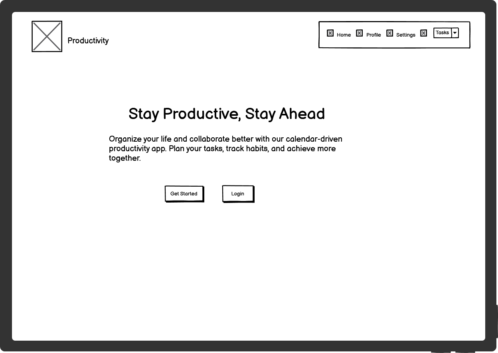
  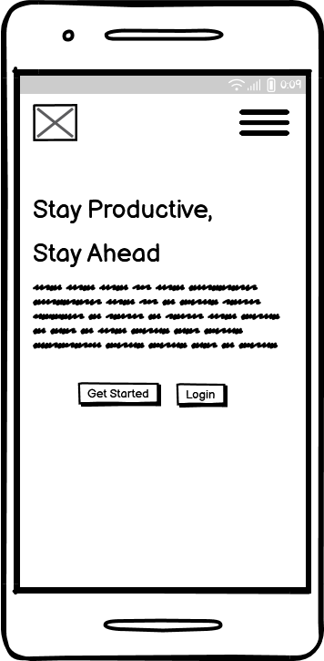
  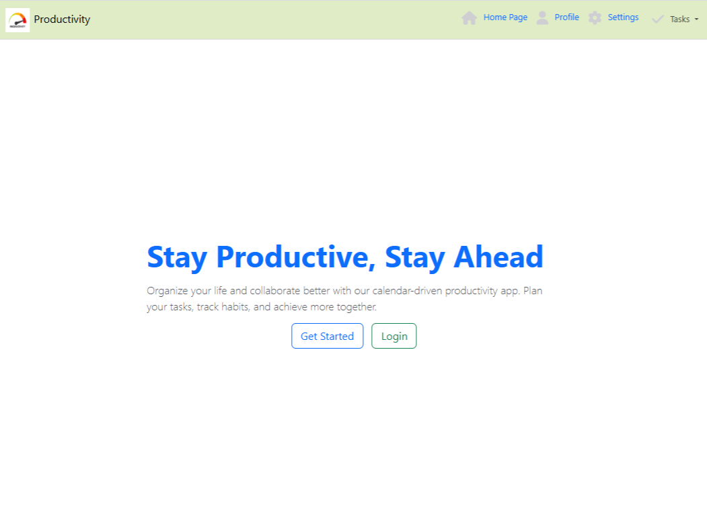
- **Profile** – User profile page
  
  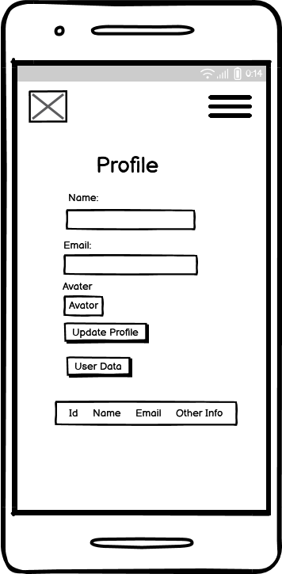
  
- **Settings** – App and account settings
  
  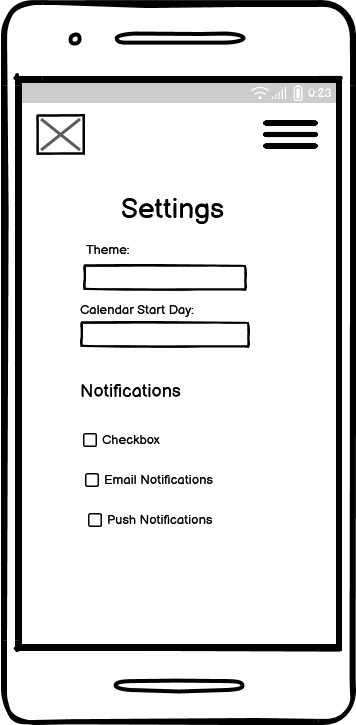
  
- **Tasks (Dropdown Menu)**:
  - Create Task
    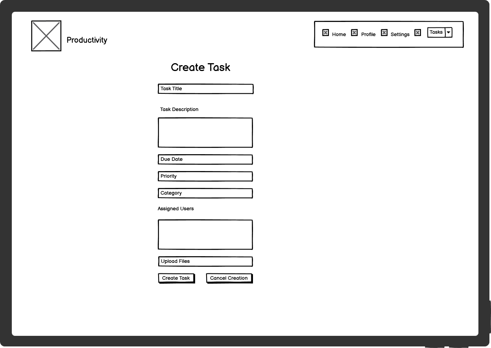
    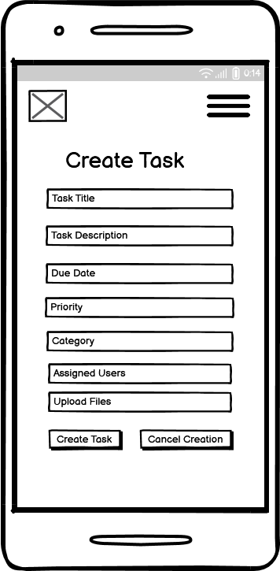
    
  - Edit Task
    
    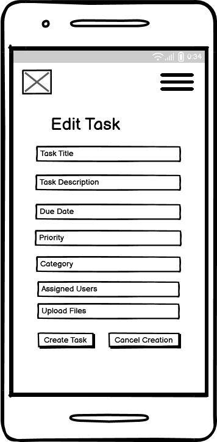
    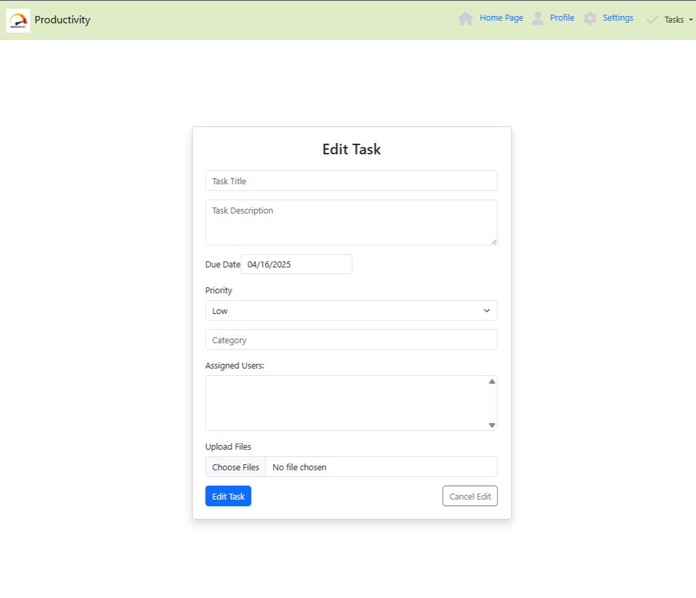
  - Task List
    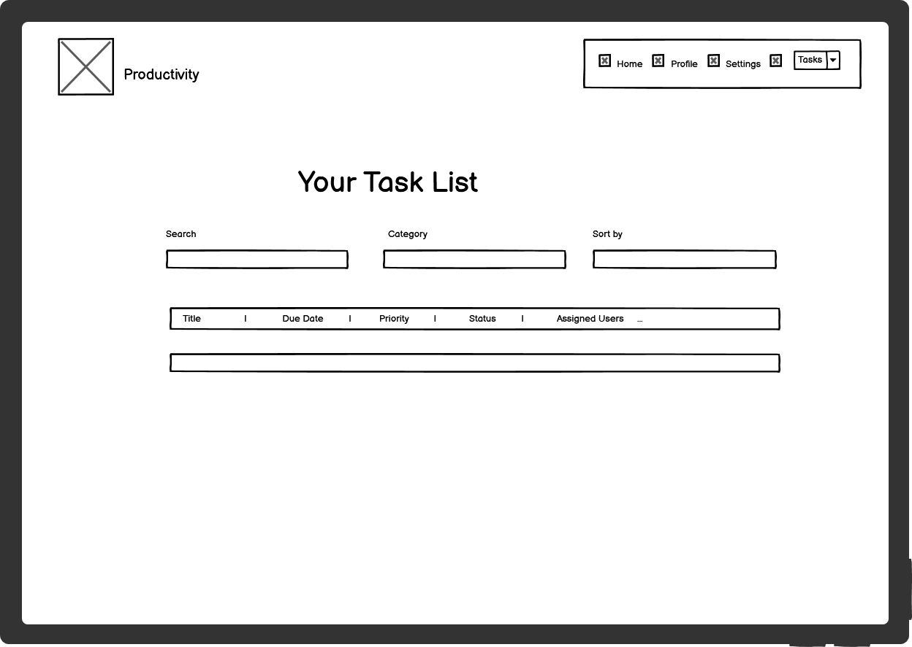
    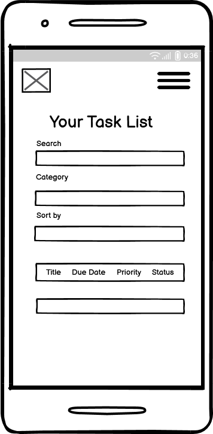
    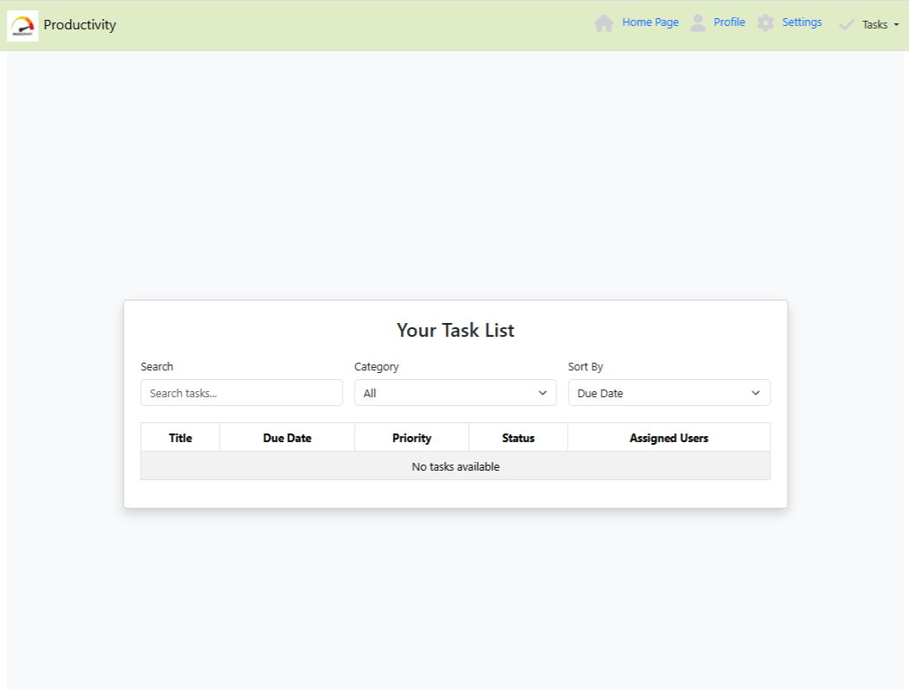

Wireframes were created using Balsamiq and informed the React component structure and routing. All major interface elements were validated against the wireframes before implementation.

### Component-Based Architecture

- Functional React components (HomePage, Login, Register, CreateTask, TaskList, NotFound, ProtectedRoute)

### Accessibility

- Semantic HTML & ARIA
- High contrast & responsive fonts
- Keyboard navigability

---

## Agile Methodology

- GitHub Issues, Milestones, Kanban Board
- MoSCoW prioritization
- Epics: Authentication, Task Management, UI

---

## Version Control

- Git & GitHub
- Commit best practices
- ESLint enforced

---

## Features

### Existing Features

- Task creation & management
- Filtering, searching
- Responsive design
- Toast notifications

# Component-Based Architecture

- Built with React functional components for modularity.
- Components (**HomePage, Login, Register, CreateTask, TaskList, NotFound, ProtectedRoute**) handle specific UI/logic responsibilities.
- Uses **api.js** for centralized API requests.

---

# Accessibility

- Semantic HTML and ARIA attributes for screen reader compatibility.
- High-contrast colors and responsive typography for readability.
- Keyboard-navigable forms and buttons.
- Bootstrap’s accessible components for consistent UX.

---

# Agile Methodology

To address **LO2.3**, the project adopted agile practices using GitHub:

- **GitHub Issues**: 10 issues created, each tied to a user story (e.g., _“Implement Login Form [Must]”_, _“Add Task Filtering [Should]”_).

  - **Description**: User story, acceptance criteria, tasks.
  - **Labels**: MoSCoW prioritization (7 Must, 3 Should), component (e.g., UI, API).
  - **Assignee**: Developer (self).
  - **Milestone**: Linked to epics (Authentication, Task Management, UI).

- **Project Board**: Kanban board with columns (_Backlog, To Do, In Progress, Done_).

- **Milestones**:

  - **Authentication Epic**: Login, registration, JWT handling, NavBar username (LO4.7).
  - **Task Management Epic**: Task creation, listing, filtering.
  - **UI Epic**: Responsive design, toast notifications (LO4.2).

- **MoSCoW Prioritization**:
  - 7 “Must” features (auth, task CRUD).
  - 3 “Should” features (e.g., filtering).

✅ This ensured transparent, iterative development.

---

# Version Control

The project uses Git on GitHub for version control. To address **LO1.13** and **LO3.11**, commits follow best practices:

- **Subject**: Imperative, <50 characters (e.g., _“Add toast notifications for CRUD”_).
- **Body**: Detailed, wrapped at 72 characters, explaining _what_ and _why_.

### Examples

- _“Fix ESLint errors in CreateTask.js”_: Resolved linting issues for code quality (LO3.1).
- _“Add username display in NavBar”_: Implemented for login state clarity (LO4.7).
- _“Set up GitHub Issues for agile”_: Added agile tools to resolve LO2.3.
- Removed commented-out code to maintain clean codebase (feedback addressed).

---

# Features

## Existing Features

### General Features

- Create tasks with title, description, due date, priority, category, status, and assigned users.
- View and filter tasks by category and status.
- Search tasks by title/description.
- Real-time toast notifications for CRUD operations (LO4.2).
- Responsive design across devices (LO1.9).
- Username display in NavBar for logged-in users (LO4.7).

### Navigation Bar

- **Component**: `NavBar.js`.
- **Features**:
  - Responsive, collapses to hamburger menu on mobile.
  - Links: Home, Login, Register, Create Task, Task List (protected).
  - Displays username for logged-in users (LO4.7).
  - Uses Bootstrap + react-router-dom.
- **Purpose**: Provides intuitive navigation and login state clarity.

### Home Page Component

- **Component**: `HomePage.js`.
- **Features**:
  - Welcoming headline and subtext.
  - Call-to-action buttons for Login and Register.
  - Responsive Bootstrap layout.
- **Purpose**: Introduces the app and guides users to authenticate.

### User Register Component

- **Component**: `Register.js`.
- **Features**:
  - Form: name, email, password, confirm password.
  - POST request to `/api/register/` via `api.js`.
  - Toast notifications for success/errors (LO4.2).
  - Redirects to `/login` on success.
  - Responsive Bootstrap UI.
- **Purpose**: Enables new user onboarding.

### User Login Component

- **Component**: `Login.js`.
- **Features**:
  - Form: email + password.
  - POST request to `/api/login/` with JWT storage.
  - Toast notifications for success/errors (LO4.2).
  - Redirects to `/tasklist` on success.
  - Responsive Bootstrap UI.
- **Purpose**: Secure user authentication.

### Create Task Component

- **Component**: `CreateTask.js`.
- **Features**:
  - Form: title, description, due date (react-datepicker), priority, category, status, assigned users.
  - POST request to `/api/tasks/`.
  - Toast notifications for success/errors (LO4.2).
  - Responsive Bootstrap UI with Card.
- **Purpose**: Allows task creation with detailed inputs.

### Task List Component

- **Component**: `TaskList.js`.
- **Features**:
  - Displays tasks in table format.
  - Filters: category & status; search by title/description.
  - Toast notifications for updates (LO4.2).
  - Responsive Bootstrap UI.
- **Purpose**: Enables task viewing and management.

### Not Found Component

- **Component**: `NotFound.js`.
- **Features**:
  - Displays 404 message with image (_no-results.png_).
  - Responsive Bootstrap layout.
- **Purpose**: Handles invalid routes gracefully.

### Protected Route Component

- **Component**: `ProtectedRoute.js`.
- **Features**:
  - Restricts access to `/createtask` and `/tasklist`.
  - Redirects unauthenticated users to `/login`.
- **Purpose**: Ensures secure access to task management.

---

# Testing

## Manual Testing

**Authentication**

- Register: Valid/invalid inputs tested (duplicate email, weak password). Toast notifications confirmed (LO4.2).
- Login: Verified credentials, JWT storage, and redirects.
- Logout: Session cleared, redirect to home.
- Protected Routes: Redirects unauthenticated users to `/login`.

**Task Management**

- Create Task: All fields tested, datepicker works, toast confirmed.
- Task List: Verified display, filters, and search.
- Responsiveness: Tested on desktop, tablet, mobile.
- User Feedback: Toast notifications for all CRUD (LO4.2).

**Navigation**

- All NavBar links tested, username displayed (LO4.7).
- Routing & redirects validated.

**Error Handling**

- Error messages confirmed for invalid forms, API failures, 404 routes.

## Automated Testing

- **Component Rendering**: Jest + React Testing Library validated all components.
- **Form Interactions**: Tested input state + submissions.
- **API Integration**: Mocked Axios for `/api/register/`, `/api/login/`, `/api/tasks/`, `/api/users/` (success + errors).
- **Routing**: ProtectedRoute redirects and NavBar links tested.
- ✅ All tests passed → robust frontend.

---

# Known Issues

- Search limited to title/description (planned enhancement).
- File uploads incomplete; postponed.
- Overdue task marking not implemented (needs backend logic).
- Profile management not implemented (needs API + UI).

---

# Deployment

## Render

1. Built app: `npm run build`.
2. Pushed to GitHub:

   ```bash
   git add .
   git commit -m "Prepare frontend for Render deployment"
   git push origin main

   ```

3. Created Static Site on Render.com

- Connected GitHub repository.

- Settings:
- **Branch:** main
- **Build Command:** npm run build
- **Publish Directory:** build

---

4. Enabled auto-deploys for new commits

---

5. Added \_redirects in public/ for React Router:

---

6. Live URL: https://project-5-productivity-frontend.onrender.com/

# Final Frontend Project Scope Reflection

## Project Background

The project aimed to build a comprehensive productivity app with task management, user profiles, settings, and a calendar view, inspired by professional tools like Trello and Todoist.

## What Changed

Due to time and resource constraints, the scope was narrowed to focus on core functionality to deliver a polished MVP. This decision prioritized quality over breadth, addressing critical user stories.

## Final Features Implemented

- **Authentication:** Secure login/register with JWT, toast notifications (LO4.2), and NavBar username display (LO4.7).
- **Task Management:** Create and view tasks with due dates, priority, category, status, and assigned users; includes filtering and search.
- **Responsive UI:** Bootstrap-based, mobile-friendly design (LO1.9).
- **API Integration:** Seamless connection to Django backend.

## Features Postponed

- **User Profile View:** Requires additional API endpoints and UI.
- **Settings Page:** Needs backend settings model and UI.
- **Edit Task View:** Requires task update endpoint integration.
- **Calendar View:** Needs react-calendar or similar integration.
- **File Attachments:** Partially implemented; full functionality postponed.
- **Overdue Task Marking:** Requires backend is_overdue logic integration.

## Reflection

Reducing scope was a strategic choice to ensure a stable, high-quality MVP. This process taught the importance of prioritizing core features, maintainability, and realistic deadlines. Postponed features are planned for a future version 2.0, potentially with react-calendar and enhanced file handling.

## What’s Next?

Future enhancements include:

- Adding profile and settings views.
- Implementing task editing and calendar views.
- Enhancing file uploads and overdue task indicators.

This experience strengthened skills in practical product decisions and delivering robust software.

---

# Credits

## Tutorials & Code Used

- **React Bootstrap:** Documentation for responsive UI components.
- **React Router:** Guides for SPA routing.
- **React Toastify:** Tutorial for implementing notifications.
- **Axios:** Documentation for API request handling.
- **React Datepicker:** Guide for date picker integration.

## Acknowledgments

- **Code Institute Student Care Team:** For their support during late submission.
- **Code Institute Staff:** For providing full-stack development training.
- **Render.com Manual:** Enabled successful deployment.
